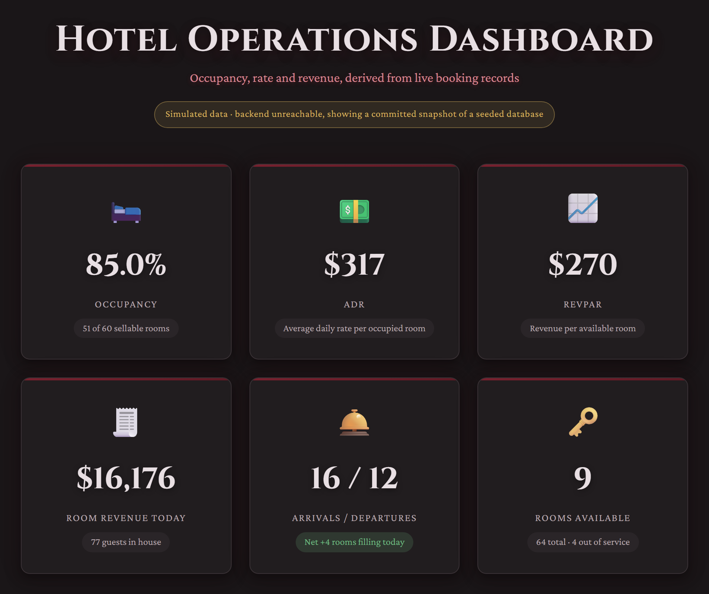
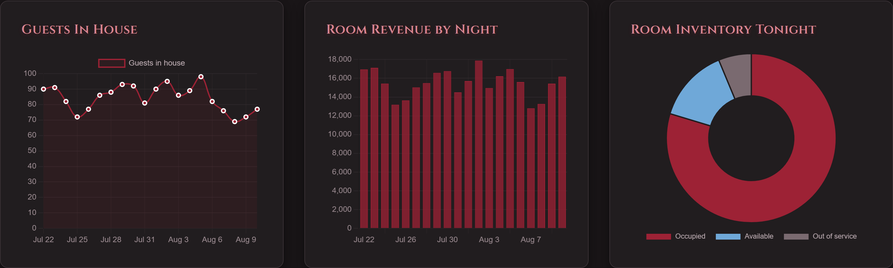

# EtherealHotel

[](https://github.com/mille409Fog/ethereal-hotel/actions/workflows/code-quality.yml)
[](https://github.com/mille409Fog/ethereal-hotel/actions/workflows/supply-chain.yml)

**Live demo:** https://ethereal-hotel-pink.vercel.app/

A hotel operations dashboard and portfolio site built with Angular 22 and FastAPI. Every
figure on the dashboard — occupancy, ADR, RevPAR, revenue — is **derived from real booking
records** in a SQLite database, not generated from random numbers.



> The screenshot above predates the backend deployment, so its badge reads "simulated data".
> The live demo now serves real figures from a deployed API and the badge reads "Live data ·
> polled from the API every few seconds" — the hosted API is serverless and has no WebSocket,
> so the dashboard polls instead of streaming and says which it is doing. If the API is ever
> unreachable it falls back to a committed snapshot of a real seeded database and labels that
> "simulated data". See [Deployment](#-deployment).



### The booking form writes to the same database

`/dashboard` reads. `/booking` writes: a reactive form that creates a real row through
`POST /api/bookings`, then shows it in a list read back from `GET /api/bookings`. Reload the
page and it is still there, because it was never anywhere else.


The screenshot is the interesting state. Check-out must be at least one night after check-in,
and that rule is **only** implemented in `backend/services/bookings.py` — there is no copy of
it in the browser. So the rejection above is a real 422 from the API, and it appears under the
input that caused it because the error carries the field name on the wire (see
[ARCHITECTURE.md](ARCHITECTURE.md#-api-endpoints)). A second implementation in TypeScript would
have been faster to render and one refactor away from disagreeing with the server.

**When the API is down, this page does not fall back to a fixture.** The dashboard does, and
that is honest there: a committed snapshot of real metrics is still a fact about the hotel, and
the badge says which you are looking at. It would not be honest here. The whole claim of a
booking form is that submitting it writes a row someone else can read back — so a fixture would
let a visitor fill the form, watch a booking appear, reload, and find it gone. Instead the form
is disabled, the badge says the API is unreachable, and the empty list says why it is empty.
Read-only and stated, rather than simulated.

## 🌟 Features

- **Real-Time Dashboard**: metrics streamed over a WebSocket every 2 seconds and drawn with Chart.js
  (the hosted demo polls instead — see [Deployment](#-deployment))
- **A form that actually writes**: `/booking` creates real bookings and renders server-side
  validation on the field that caused it
- **Domain-derived metrics**: occupancy, ADR and RevPAR computed from rooms, guests and bookings
- **Accessible**: WCAG 2.1 AA, verified in CI by axe — see [Accessibility](#-accessibility)
- **Code Quality**: linting, formatting, type checking and tests gated in CI for _both_ languages
- **CI/CD Pipeline**: GitHub Actions running the same commands documented here
- **Modern Stack**: Angular 22 signals + TypeScript 6.0 (strict), FastAPI on Python 3.11

## 🚀 Quick Start

### Prerequisites

- **Node.js** — `^22.22.3 || ^24.15.0`, as `package.json` `engines` enforces. `.nvmrc` pins
  **22.22.3**, which is what CI installs; the Vercel deploy builds on 24.x.
- **npm** v11+ (`packageManager` pins 11.16.0)
- **Python 3.11+** for the backend — the version CI runs, `backend/Dockerfile` builds on, and
  both ruff (`target-version = "py311"`) and mypy (`python_version = "3.11"`) assume.

### Installation

#### Frontend Setup

```bash
# Clone the repository
git clone <repository-url>
cd ethereal-hotel

# Install dependencies
npm install

# Start development server
npm start
```

Navigate to `http://localhost:4200/` to view the application.

#### Backend Setup

```bash
# Navigate to backend directory
cd backend

# Run the setup and start script (Windows)
run.bat

# Or manually:
# Create virtual environment
python -m venv venv

# Activate virtual environment (Windows)
venv\Scripts\activate

# Install dependencies
pip install -r requirements.txt

# Start backend server
python main.py
```

Backend will be available at:

- REST API: `http://localhost:8000`
- WebSocket: `ws://localhost:8000/ws`
- API Docs: `http://localhost:8000/docs`

## 📜 Available Scripts

### Development

```bash
# Start development server
npm start

# Build for production
npm run build

# Watch mode for development
npm run watch
```

### Testing

```bash
# Run frontend unit tests with Vitest, printing a coverage summary.
# Fails if coverage drops below the thresholds in angular.json.
npm test

# Run the backend suite: 26 pytest tests against an isolated, deterministically
# seeded SQLite database. No running server required.
npm run test:backend

# Build, serve dist/, and run the full Playwright suite (smoke + accessibility).
# Needs `npx playwright install --only-shell chromium` once.
npm run e2e

# Just the accessibility half: an axe scan of /, /dashboard and /booking (the
# last one twice — at rest and while showing a server-side validation error),
# plus keyboard and reduced-motion checks.
npm run a11y
```

### Code Quality

```bash
# Run ESLint (--max-warnings 0: a single new warning fails the command)
npm run lint

# Fix ESLint issues automatically
npm run lint:fix

# Format code with Prettier
npm run format

# Check code formatting
npm run format:check

# Run all frontend quality checks
npm run code-quality
```

The backend has the same three gates, run through the same npm entry points so
you don't have to remember two sets of commands:

```bash
# Ruff — lint (--fix to auto-fix) and format, replacing black/isort/flake8
npm run lint:py
npm run lint:py:fix
npm run format:py
npm run format:py:check

# Mypy in strict mode
npm run typecheck:py

# All three at once
npm run code-quality:py
```

These wrap `ruff` and `mypy` from `backend/venv` via `scripts/py-tool.mjs`, so
they work whether or not you have the virtualenv activated. Both tools read
their configuration from `pyproject.toml` at the repo root.

## 🛠️ Tech Stack

### Frontend

- **Framework**: Angular 22 (standalone components, signals, OnPush everywhere)
- **Language**: TypeScript 6.0, `strict` on
- **State Management**: signals (`signal` / `computed` / `input`) over an RxJS 7.8 transport
- **Charts**: Chart.js 4.5
- **Build Tool**: Angular CLI 22
- **Testing**: Vitest 4.0
- **Code Quality**: ESLint + Prettier + Husky
- **CI/CD**: GitHub Actions

### Backend

- **Framework**: FastAPI 0.141
- **Language**: Python 3.11+
- **Server**: Uvicorn (ASGI)
- **Validation**: Pydantic 2.9
- **Real-time**: WebSockets
- **API Docs**: Auto-generated (Swagger/ReDoc)
- **Code Quality**: Ruff (lint + format) + mypy (strict)

## 📋 Code Quality Standards

This project implements professional code quality tools and practices:

Both languages are gated, not just the TypeScript half:

- ✅ **ESLint**: Strict TypeScript and Angular linting rules, enforced at zero warnings
- ✅ **Prettier**: Consistent code formatting
- ✅ **Ruff**: Python linting _and_ formatting, enforced at zero errors
- ✅ **Mypy**: Python type checking in strict mode
- ✅ **axe**: Accessibility scan of both routes in CI, blocking on serious and critical findings
- ✅ **Vitest**: Unit tests with coverage thresholds that fail the build when they regress
- ✅ **Pytest**: 22 backend tests against an isolated, deterministically seeded database
- ✅ **Husky**: Git hooks for pre-commit validation
- ✅ **Lint-staged**: Automatic formatting of staged files, TypeScript and Python alike
- ✅ **Commitlint**: Conventional commit message validation
- ✅ **Dependabot**: Weekly grouped updates for pip, npm and GitHub Actions
- ✅ **npm audit + pip-audit**: Advisory scan of both dependency trees, failing the build
- ✅ **CodeQL**: Static security analysis of the TypeScript and the Python
- ✅ **CI/CD Pipeline**: Automated testing and builds

## ♿ Accessibility

Accessibility is enforced here rather than asserted. The
`@angular-eslint/template` accessibility rule set runs at **error** severity, and every commit is
scanned by **axe** against the production build on `/`, `/dashboard` and `/booking` — the CI job
fails on any serious or critical finding, and every route currently reports **zero violations at
every severity**. `/booking` is scanned twice: once at rest, and once with a rejected field on
screen, because an error message is new content inserted after load that has to be associated with
its control, and a form that scans clean empty can still fail the moment it fails.
Alongside the scan, Playwright checks the things axe cannot: that the first Tab reaches
a skip link, that the nav is traversable and moves focus to the section it targets, and that under
`prefers-reduced-motion` the animations stop and no content stays stranded behind a fade-in.

Two decisions worth naming, because both went against the obvious version:

- **The metrics grid is deliberately not an `aria-live` region.** The socket pushes a snapshot every
  two seconds; announcing six cards at that cadence produces speech a listener can never get ahead
  of, which is worse than silence, not better. Instead one throttled `role="status"` region speaks a
  plain-language digest at most every 30 seconds ("Occupancy 85.0 percent. 51 of 60 sellable rooms
  occupied…"), and a second announces backend connect/disconnect transitions — so a screen reader
  user learns when the figures stop being real.
- **The brand red is now two tokens.** `--color-blood` (`#9d2235`) reached only ~2:1 as text on this
  background. It stays for borders, fills and glows; `--color-blood-text` carries anything anyone
  has to read, and the focus ring moved to it as well, since a 2:1 focus indicator fails
  WCAG 1.4.11 and is genuinely hard to find on a dark theme.

### Git Commit Convention

This project follows [Conventional Commits](https://www.conventionalcommits.org/):

```bash
# Examples
git commit -m "feat: add user authentication"
git commit -m "fix: resolve dashboard loading issue"
git commit -m "docs: update README"
```

**Commit Types**: `feat`, `fix`, `docs`, `style`, `refactor`, `perf`, `test`, `chore`, `ci`, `build`, `revert`

### Coding Standards

Enforced by ESLint (`eslint.config.mjs`) and Prettier (`.prettierrc`). `npm run lint` runs with
`--max-warnings 0`, so every rule below is a build failure, not a suggestion:

- **TypeScript**: no `any`, explicit return types and accessibility modifiers, prefer `const`,
  max function complexity 10 / length 100 lines. `tsconfig.json` sets `strict: true`, so the
  compiler enforces null-safety underneath all of it.
- **Angular**: `app-` selector prefix, lifecycle interfaces, OnPush change detection,
  a track expression on every loop (`use-track-by-function`).
- **Templates**: banana-in-box syntax, no negated async, no duplicate attributes.
- **General**: no `console.log` (use `console.warn`/`console.error`), no `debugger`, strict equality
  (`===`), always use curly braces, prefer arrow functions and template literals.

Two rules are deliberately **off**, each with a comment in `eslint.config.mjs` explaining why:
`@angular-eslint/component-class-suffix` (the Angular style guide dropped the mandatory `Component`
suffix) and `@angular-eslint/template/no-call-expression` (it predates signals, and a signal read is
a memoized call expression).

#### Python

Enforced by Ruff and mypy, both configured in `pyproject.toml` at the repo root. CI runs
`ruff check`, `ruff format --check` and `mypy` on every push, so these are build failures too:

- **Ruff lint**: pyflakes, pycodestyle, isort, pep8-naming, pyupgrade, bugbear, blind-except,
  comprehensions, simplify and tidy-imports. `RUF100` is on, so a stale `# noqa` is itself an error.
- **Ruff format**: 88-column Black-compatible formatting. `.editorconfig` matches it.
- **Mypy**: `strict = true` plus `warn_unreachable`. Every function in `backend/` is annotated —
  the metrics payloads are `TypedDict`s, so a typo in a metric key fails the type check rather than
  reaching the frontend as a missing field.

Four exceptions are configured, each with a comment in `pyproject.toml` giving the reason rather
than being switched off silently:

| Rule       | Where                     | Why                                                                                                                      |
| ---------- | ------------------------- | ------------------------------------------------------------------------------------------------------------------------ |
| `B008`     | FastAPI `Depends`/`Query` | Calling them in argument defaults _is_ the DI syntax                                                                     |
| `N815`     | `schemas.py`              | camelCase fields are the wire contract the Angular `IMetrics` consumes                                                   |
| `N818`     | `services/bookings.py`    | `ReferenceNotFound` reads better than `ReferenceNotFoundError`; the base class carries the suffix                        |
| formatting | `**/*.md`                 | Ruff formats Python blocks inside Markdown; the ```python blocks in these docs are illustrative payload shapes, not code |

### Test Coverage

`npm test` reports coverage and fails below the thresholds set in `angular.json` under
`test.options.coverageThresholds`. The thresholds are floors, deliberately set a little under
the current figures — V8 attributes function coverage slightly differently across Node
versions, so a threshold pinned to the exact number would fail on a version bump rather than
on a real regression. That headroom is why `.nvmrc` pins the Node version CI uses.

| Metric     | Threshold | Currently |
| ---------- | --------- | --------- |
| Statements | 90%       | 97.05%    |
| Branches   | 88%       | 93.84%    |
| Functions  | 74%       | 95.89%    |
| Lines      | 90%       | 96.88%    |

When new tests push the real numbers up durably, raise the floors to match.

## 🏗️ Project Structure

```
ethereal-hotel/
├── src/
│   ├── app/
│   │   ├── dashboard/        # Real-time dashboard feature (/dashboard)
│   │   ├── booking/          # Booking form + list (/booking)
│   │   ├── projects/         # Projects showcase
│   │   ├── experience/      # Experience section
│   │   ├── skills/          # Skills section
│   │   ├── resume/          # Resume section
│   │   ├── directives/      # Reusable directives
│   │   ├── services/        # Shared services
│   │   └── ...
│   └── ...
├── backend/
│   ├── main.py                  # FastAPI application
│   ├── routers/                 # HTTP + WebSocket endpoints
│   ├── services/                # Business logic, no FastAPI imports
│   ├── db/                      # Models, metrics, seeder
│   ├── tests/                   # pytest suite
│   ├── requirements.txt         # Runtime Python dependencies
│   ├── requirements-dev.txt     # Tests + ruff/mypy
│   ├── run.bat                  # Windows startup script
│   └── README.md                # Backend documentation
├── e2e/                         # Playwright: smoke tests + axe audit
├── scripts/
│   ├── py-tool.mjs              # Resolves ruff/mypy/pytest for npm + lint-staged
│   └── serve-dist.mjs           # Static server for the Playwright suites
├── docs/images/                 # README screenshots
├── .github/
│   ├── workflows/               # CI/CD pipelines
│   └── dependabot.yml           # pip + npm + github-actions updates
├── .husky/                      # Git hooks
├── .nvmrc                       # Node version CI installs (22.22.3)
├── pyproject.toml               # Ruff + mypy configuration
├── ARCHITECTURE.md              # System architecture & data flow
├── CONTRIBUTING.md              # Setup and the gates a PR must pass
├── LICENSE                      # MIT
└── ...
```

## 🔍 Key Features Demonstrated

### 1. Real-Time Data Handling

- A self-healing WebSocket that reconnects with exponential backoff (1s → 30s cap)
- Subscriptions torn down by `takeUntilDestroyed(DestroyRef)`, not manual `unsubscribe()`
- Live metric updates every 2 seconds, from one shared broadcast task on the server

### 2. Modern Angular Patterns

- Standalone components — there is no `NgModule` in the codebase
- Signal-based state: `signal()` for component state, `computed()` for derived values,
  the `input()` signal API instead of `@Input()` decorators
- Built-in control flow (`@for` / `@if`), not the legacy structural directives
- Lazy loading with route-based code splitting (`loadComponent` on both routes)
- OnPush change detection strategy (lint-enforced on every component)

### 3. Professional Development Workflow

- Pre-commit hooks prevent broken code
- Automated CI/CD pipeline
- Conventional commit messages
- Comprehensive linting rules

### 4. Code Organization

- Feature-based folder structure
- Reusable components and directives
- Separation of concerns
- TypeScript strict mode

## 🧪 Testing

Four suites, all runnable from the repo root:

| Command                | What it runs                                                                       |
| ---------------------- | ---------------------------------------------------------------------------------- |
| `npm test`             | Vitest unit tests + coverage gate                                                  |
| `npm run test:backend` | 22 pytest tests against a seeded, isolated SQLite database                         |
| `npm run e2e`          | Playwright smoke tests + the axe accessibility audit, against the production build |
| `npm run a11y`         | Just the accessibility audit                                                       |

The Playwright suites run against `dist/` rather than `ng serve`, so they exercise the
production `fileReplacements`, the lazy chunks and the minified CSS that users actually load.

## ⚙️ Configuration

### Frontend (Angular environments)

The API base URLs are **not hardcoded**. They live in Angular environment files:

- `src/environments/environment.ts` — development (defaults to `http://localhost:8000`).
- `src/environments/environment.prod.ts` — production (relative, same-origin URLs).
- `src/environments/environment.model.ts` — the interface both must satisfy, so a field added
  to one and forgotten in the other fails to compile instead of failing in production.

`angular.json` swaps `environment.ts` for `environment.prod.ts` on production builds
(`fileReplacements`).

Production addresses the API **relatively** (`apiUrl: '/api'`) because the API is deployed as
a function on the same Vercel project. That is worth more than it looks: there is no CORS
preflight, no origin to keep in sync with `ALLOWED_ORIGINS`, and no hostname that can rot —
every preview deployment gets a working backend at its own URL with no edit here.

`wsUrl` is `null` in production. That is not "not configured yet": it is the instruction to
use the polling transport, because a serverless function cannot hold a socket open. The
dashboard picks its transport from this field and labels the result honestly:

| `wsUrl`             | Transport                                 | Badge                                             |
| ------------------- | ----------------------------------------- | ------------------------------------------------- |
| set                 | WebSocket, pushed every 2s                | Live data · streaming from the API                |
| `null`              | `GET /api/metrics` every `pollIntervalMs` | Live data · polled from the API every few seconds |
| — (API unreachable) | none; committed fixture                   | Simulated data · backend unreachable              |

The fallback is `src/app/services/offline-dashboard.fixture.json` — a committed snapshot of a
real seeded database, not generated numbers.

### Backend (environment variables)

There is **no `.env` loading**. `backend/config.py` reads `os.getenv` at import time and
nothing calls `load_dotenv()`, so configuration comes from real environment variables — set
them in your shell, `docker-compose.yml`, or your host's dashboard. Every one has a default
that makes a fresh clone run, so none is required:

| Env var                      | Default               | Purpose                                                                     |
| ---------------------------- | --------------------- | --------------------------------------------------------------------------- |
| `DATABASE_URL`               | local SQLite file     | Swap in Postgres, etc.                                                      |
| `ALLOWED_ORIGINS`            | localhost dev servers | Comma-separated CORS allowlist                                              |
| `LOG_LEVEL`                  | `INFO`                | Unknown values fall back to INFO with a warning rather than failing startup |
| `BROADCAST_INTERVAL_SECONDS` | `2`                   | Stream cadence                                                              |

When the API is on a **different origin** from the frontend — the container deployment — set
the CORS allowlist to that frontend's origin:

```bash
export ALLOWED_ORIGINS="https://ethereal-hotel-pink.vercel.app"
```

The hosted demo needs none of this: the API is same-origin, so the browser never issues a
preflight and `ALLOWED_ORIGINS` is never consulted. Not having to configure it is one of the
reasons the API is deployed alongside the frontend rather than on a host of its own.

## 🚢 Deployment

There are two supported targets, and they are not the same deployment. The difference is
deliberate and visible on screen rather than papered over.

### The hosted demo — one Vercel project, both halves

Live at https://ethereal-hotel-pink.vercel.app/.

|          |                                                                                   |
| -------- | --------------------------------------------------------------------------------- |
| Frontend | `npm run build` → `dist/ethereal-hotel/browser`                                   |
| Backend  | `api/index.py`, a Python function running the same FastAPI app from `backend/`    |
| Routing  | `vercel.json` rewrites `/api/*` to the function, everything else to the SPA shell |
| Python   | 3.12, pinned by `.python-version` and `requires-python` in `pyproject.toml`       |

Verify it in one command:

```bash
curl https://ethereal-hotel-pink.vercel.app/api/health
# {"status":"online","service":"EtherealHotel Dashboard API","version":"2.1.0",
#  "liveStream":false,"endpoints":{...}}
```

Three things about this deployment are worth knowing before you read it as sloppy:

- **No WebSocket.** `liveStream: false` in the health payload is the API telling you so, and
  it does not advertise a `/ws` it cannot serve. A function invocation has no process to hold
  a socket open, so the dashboard polls `/api/metrics` instead and the badge says "polled",
  not "streaming". The socket is a real feature — it just belongs to the container below.
- **The database is rebuilt on every cold start**, into the function's temp directory, from a
  **fixed RNG seed**. Fixing the seed is what stops two instances serving two different
  hotels; anchoring the seeding to `date.today()` is what stops the demo decaying into a
  stale snapshot the way a committed database would. The figures are still derived from real
  `Room`/`Guest`/`Booking` rows — the seed decides which rows, not what the numbers mean.
- **Writes do not persist.** `POST`/`DELETE /api/bookings` work and move the metrics, but only
  for that instance's lifetime. The dashboard itself is read-only, so this is invisible in
  normal use; it matters if you go poking at the API.

Cold start is roughly a second — the seeding step measures ~0.16s. There is no free-tier
spin-down delay here, which was the main reason to prefer this over a container host.

### The full stack — container

```bash
docker build -t ethereal-hotel-api backend/
docker run -p 8000:8000 -e ALLOWED_ORIGINS="https://your-frontend" ethereal-hotel-api
```

This is the deployment with the live WebSocket, the shared broadcaster, and a database that
persists. Point a frontend at it by setting `apiUrl`/`wsUrl`/`healthUrl` in
`environment.prod.ts` to its origin, and add that origin to `ALLOWED_ORIGINS` — cross-origin
means CORS applies again, which the same-origin demo avoids entirely.

Both targets build the app through the same `create_app()` in `backend/main.py`; the function
passes `live_stream=False`. There is no second copy of the wiring to keep in sync.

### A note on Python versions

The container and CI run **3.11**; the hosted function runs **3.12**, because Vercel's Python
runtime offers 3.12/3.13/3.14 and no 3.11. Rather than leave that gap untested, the CI matrix
runs the backend suite on both. Runtime dependencies are declared twice for the same reason —
`backend/requirements.txt` for the container, `[project.dependencies]` in `pyproject.toml` for
Vercel — and `backend/tests/test_dependency_pins.py` fails if the two lists ever disagree.

### Build for Production

```bash
npm run build
```

The build artifacts will be stored in the `dist/` directory, optimized for production deployment.

## 👨‍💻 Development

### VS Code Setup

Recommended extensions (defined in `.vscode/extensions.json`):

- Angular Language Service
- ESLint
- Prettier
- EditorConfig
- Ruff (Python lint + format, same config as CI)
- Pylance (`pyrightconfig.json` resolves the backend's imports and venv)

The project includes VS Code settings for automatic formatting and linting on save.

### Pre-commit Hooks

When you commit code, Husky runs lint-staged over the staged files only:

1. `.ts` / `.html` → ESLint `--fix`, then Prettier
2. `.css` / `.scss` / `.json` → Prettier
3. `.py` → `ruff check --fix`, then `ruff format`
4. The commit message is validated against Conventional Commits

Anything auto-fixable is fixed and re-staged, so badly formatted code cannot land. Anything
that _isn't_ auto-fixable — an undefined name, a bare `except`, an ESLint error — fails the
hook and blocks the commit until it's resolved.

The Python steps need `ruff`, which `scripts/py-tool.mjs` looks for in `backend/venv`, then in
an activated `$VIRTUAL_ENV`, then on `PATH`. If it isn't found the hook says so and points at
`backend/requirements-dev.txt` rather than failing with "command not found".

## 🤝 Contributing

See [CONTRIBUTING.md](CONTRIBUTING.md) for setup and the four gates a PR has to pass.

## 📄 License

[MIT](LICENSE) © Jacob Miller

## 📚 Additional Resources

- [ARCHITECTURE.md](ARCHITECTURE.md) — system architecture and data flow
- [backend/README.md](backend/README.md) — API reference, streaming design, deployment
- [Angular CLI Overview and Command Reference](https://angular.dev/tools/cli)
